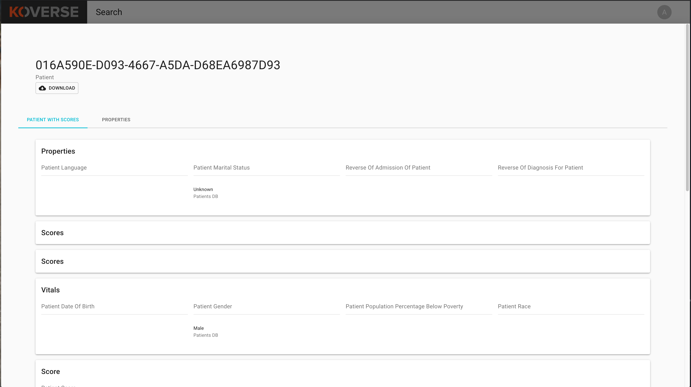

=================================
Koverse Connections Documentation
=================================
------------------
User Documentation
------------------
Contents
--------
`Accessing the User Interface`_

- `Logging in and out`_

`Navigation`_

- `Dashboard`_
- `Search`_
- `Lists`_
- `Lookalike Models`_
- `Weighted Models`_
- `Profile Views`_

`Reference`_

- `Entity Table Actions`_
  - `Create a List`_
  - `Add to a List`_
  - `Download a CSV of Entities`_
  - `Merge Entities`_
  - `Hide or Show Attributes`_

Accessing the User Interface
----------------------------
Logging in and out
++++++++++++++++++
To log into Koverse Connections

- Navigate your browser to your organizations Koverse Connections URL
- Input your user name and password at the login screen

To log out of Koverse Connections

- Click on your user icon in the upper right portion of the window and select "Log Out"

Navigation
----------
The main page of the Koverse Connections user interface displays (*the navigation can be customized and may contain more of fewer options than shown here*)

- Dashboard
- Search
- Lookalike Models
- Weighted Models
- My Account
- Manage Users
- Profile Views
- Account Icon/Menu
- Logout Button

Dashboard
---------
The dashboard contains a customized view of Lists, Lookalike Models, Weighted Models and other customizable items.

Search
------
The search page allows you to search for entities based on chosen criteria.

Search criteria can include:

- Entity type
- Text filter
- Applicable attribute names

Clicking on an entity type will display all associated entities in the results list.

With the search field, after you enter text, press return to apply the text entered as a filter.

Use the "Filter By" selections to choose attribute values of an entity to filter.

To remove a filter, simply click the "X" next to the filter attribute.
(needs image)

Clicking on an entity in the seach results will display a profile of that entity with its associated view tabs. Each view is customizable.

You can also:

- `Create a List`_
- `Add to a List`_
- `Download a CSV of Entities`_
- `Merge Entities`_
- `Hide or Show Attributes`_

Lists
-----
The Lists page displays lists available to the current user. A List is a user-curated list of entities of the same type.

Clicking on the Lists tab in the navigation menu will display the lists available to the current user.

On the Lists page you can click on a List to access it, delete a List (caution: deleting a list is a single click and does not currently require the user to click "OK"), sort the Lists by Name, Type, Owner, Recently Updated, and # of Entities.

Clicking on a List will open a view of the entities contained in that list. This view is configurable and can change based on the entity type associated with the list.

From the List view you can see the number of entities contained in the List, the entity type in the List, who created the List, when it was last updated, and a toggle to make the List private or public.
(needs image)

You can also:

- `Create A List`_
- `Add to a List`_
- `Download a CSV of Entities`_
- `Merge Entities`_
- `Hide or Show Attributes`_

Lookalike Models
----------------
A lookalike model takes a list as input and creates a new list that has recommendations for entities similar to those on the input list.

Create a Lookalike Model
++++++++++++++++++++++++

From the Lookalike Models tab:

- Click "CREATE LOOKALIKE MODEL"
- Give your lookalike model a name
- Choose the list your lookalike model will be based on
- Click "CREATE MODEL"

Your lookalike model will now appear in the Lookalike Models tab.

Lookalike Model Options
+++++++++++++++++++++++
From the Lookalike Models tab you can click on a lookalike model to access more details or click on the trash can icon to delete the lookalike model.

On the details page of a lookalike model you can:

- View more information about the lookalike model including: Name, number of entities, who created the model, and when the model was last run
- Make the lookalike model private or public using the "Private" toggle
- Run the lookalike model
- Rename the lookalike model
- See the entity results of the lookalike model

Run a Lookalike Model
+++++++++++++++++++++
To run a lookalike model, from the Lookalike Models tab, click on the lookalike model you want to run.

On the next page, click on "RUN MODEL". You should see a green prompt in the lower left hand corner of your browser window telling you "Model has been queued". This model will then run...(*NEEDS MORE INFO*)

Weighted Models
---------------
A Weighted Model creates a list based on user selected attribute weighting. For example: Potential customers are scored based on an algorithm that is as follows:
0.2*assets+0.3*last quarter performance+0.25*consultant rating+0.25*percent assets in S&P 500.

Profile Views
-------------
Profile Views present the properties of an entity. All entity types have a default profile view and may have multiple profile views. Profile views can be created and customized.

To create a new profile view, from the Profile Views tab click on "CREATE PROFILE VIEW". You will be asked to:

- Name your profile view
- Choose the entity type your profile view will display
- Create categories of properties
  - These categories will be grouped together the properties you choose
- Preview your profile view

In the Profile Views tab you can drag-and-drop profile views for an entity to change their priority. This will determine which profile view is seen first when you open the details of an entity, as well as the order of profile view tabs on the entity details page.

From the Profiles View tab you can also edit, copy, or delete a profile view by clicking on the "ACTIONS" menu on each profile view.

---------
Reference
---------

Entity Table Actions
--------------------

Create a List
+++++++++++++

To create a List, select one or more entities and click "CREATE LIST".
(needs image)

This will take you through the Create List wizard. Give the list a name and click "CREATE LIST".

This new list will then appear in the Lists tab of the sidebar.

Add to a List
+++++++++++++
To add entities to an existing List, select one or more entities you wish to add to a List and click "Add to List".

You will be prompted to select the List where the entity or entities will be added. Click "Add" or "Cancel" to finalize your choice.
(needs image)

Download a CSV of Entities
++++++++++++++++++++++++++
To download a CSV of one or more entities, select one or more entities and click the "CSV" button.
(needs image)

Merge Entities
++++++++++++++
You will be asked to select the preferred name for this merged entity.
To merge two or more entities, select the entities you want to merge and click the "Merge" button.

You will be prompted to select the preferred name for this merged entity.
(needs image)

Hide or Show Attributes
+++++++++++++++++++++++
To hide or show specific attribute columns, click on the eye icon and select or deselect the attribute columns you wish to see.

Delete
++++++
You can use the delete button next to any row to remove it from a list.

Navigating the Entity Table
+++++++++++++++++++++++++++
At the bottom of the Entity Table you can change the nuber of rows per page displayed (10, 20, 50, or 100).

To move between pages, if there are more rows than your selected display, you can click on the forward and backward arrows, or click on the page number itself.
