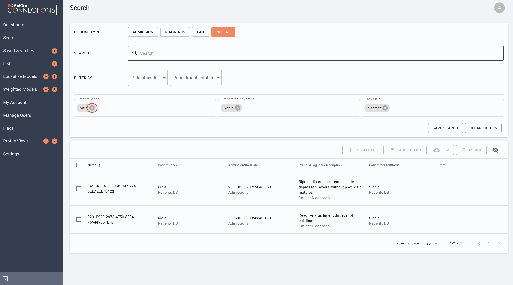
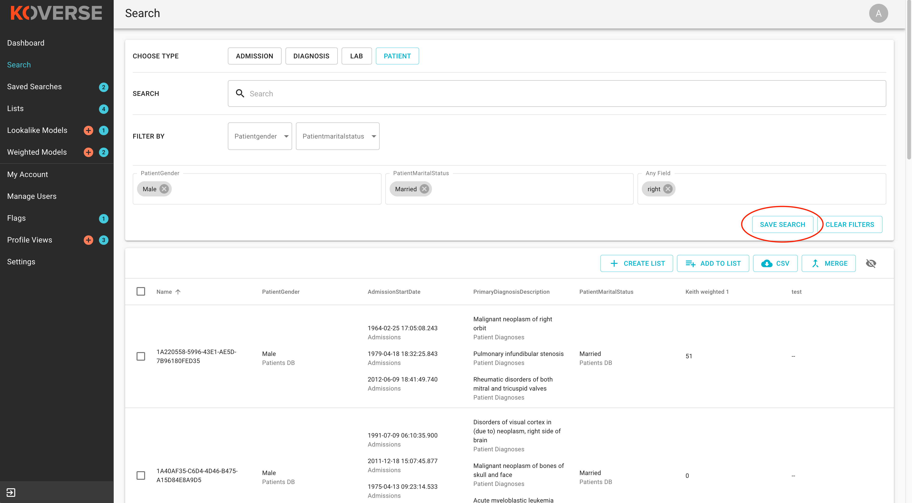
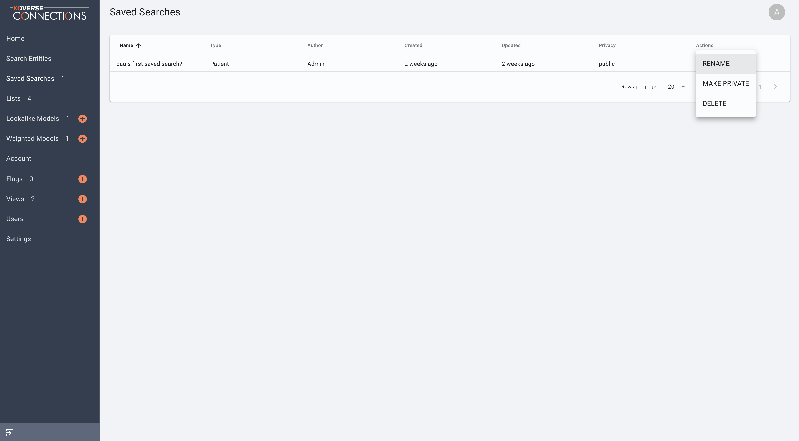
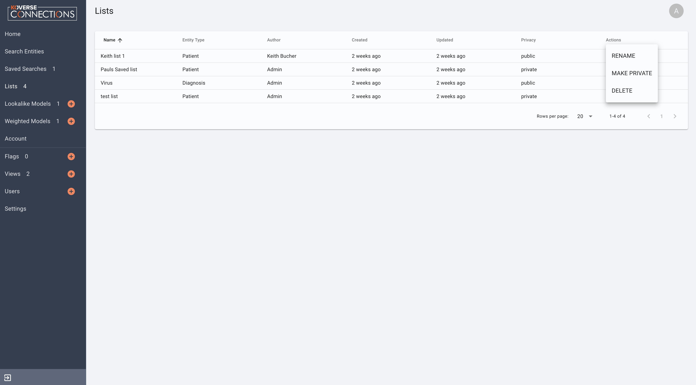
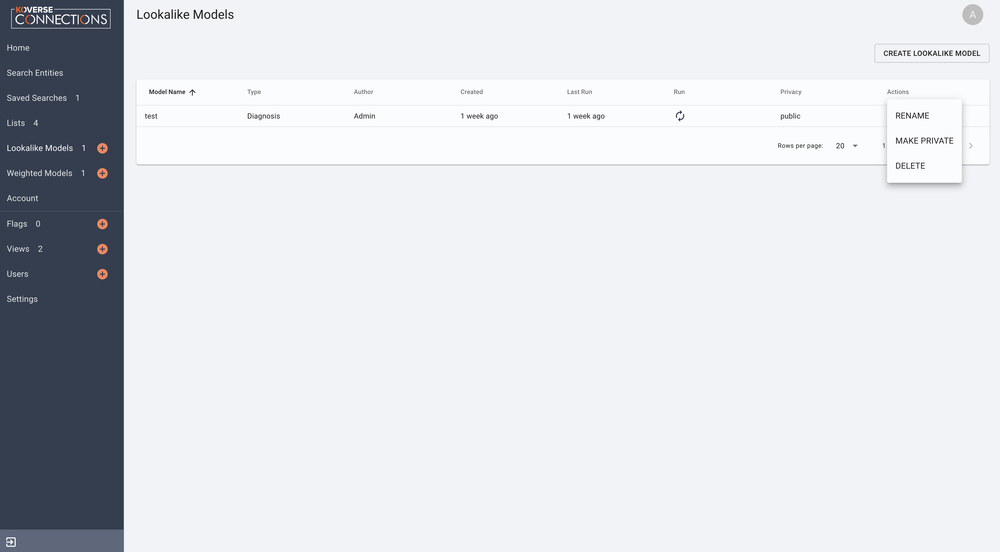
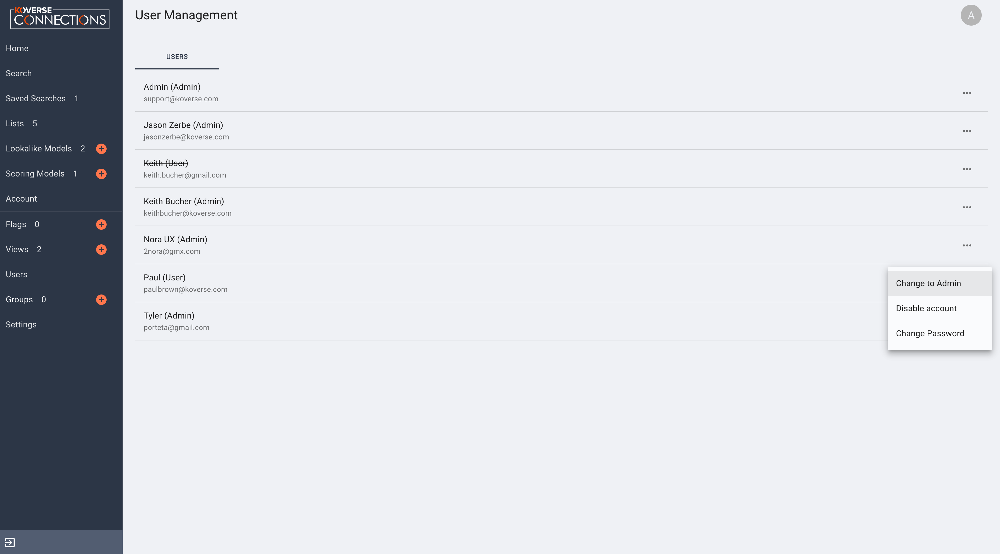

=================================
Koverse Connections Documentation
=================================
------------------
User Documentation
------------------
Contents
--------
`Accessing the User Interface`_

- `Logging in and out`_

`Navigation`_

- `Dashboard`_
- `Search`_
- `Saved Searches`_
- `Lists`_
- `Lookalike Models`_
- `Scoring Models`_

`Account`_

`Flags`_

`Views`_

`Users`_

`Settings`_

`Reference`_

- `Object Table Actions`_
  - `Create a List`_
  - `Add to a List`_
  - `Download a CSV of Entities`_
  - `Merge Entities`_
  - `Hide or Show Attributes`_

Accessing the User Interface
----------------------------
Logging in and out
++++++++++++++++++
To log into Koverse Connections

- Navigate your browser to your organizations Koverse Connections URL
- Input your user name and password at the login screen

To log out of Koverse Connections

- Click on your user icon in the upper right portion of the window and select "Log Out"

Navigation
----------
The main page of the Koverse Connections user interface displays (*the navigation can be customized and may contain more of fewer options than shown here*)

- Dashboard
- Search
- Lookalike Models
- Scoring Models
- My Account
- Manage Users
- Views
- Account Icon/Menu
- Logout Button

Dashboard
---------
The dashboard contains a customized view of Lists, Lookalike Models, Scoring Models and other customizable items.

Search
------
The search page allows you to search for entities based on chosen criteria or filters.

Search criteria can include:

- Object type
- Text filter
- Applicable attribute names

Clicking on an object type will display all associated entities in the results list.

With the search field, after you enter text, press return to apply the text entered as a filter.

Use the "Filter By" selections to choose attribute values of an object to filter.

To remove a filter, simply click the "X" next to the filter attribute.

You can also click on "CLEAR FILTERS" to remove all currently applied filters.

Clicking on an object in the seach results will display a view of that object with its associated view tabs. Each view is customizable.

.. image:: ../kc-docs/search_object_view.png

You can also:

- `Create a List`_
- `Add to a List`_
- `Download a CSV of Entities`_
- `Merge Entities`_
- `Hide or Show Attributes`_

Saved Searches
--------------
A saved search allows a user to use the search page to create a search with one or more search criteria or filters and save it so that they may use it again or share it with others.

Unlike Lists which contain static data from a pervious search, saved searches are dynamic. For example:

1. You perform a search and create a saved search
2. New data is loaded into your Koverse Connections environment after you created a saved search
3. You access the previously created saved search
4. Any new data that was loaded will now appear in your saved search if it matches your criteria.

To create a saved search, first navigate to the Search page and apply one or more search criteria or filters to an object type that you are searching within.

Click on the "SAVE SEARCH" button.

Once you have created a saved search, you can access the saved search on the "SAVED SEARCHES PAGE".

You can sort saved searches based on: Name, Type, Author, Created Date, Updated Date, and Privacy. To sort, simply click on the column header you want to sort by.

From the Actions drop-down menu you can: Rename a saved search, make Public or Private a saved search, or Delete a saved search.

By clicking on a saved search, you will be taken to the search page where you can continue to modify the search criteria and filters. This will not affect the saved search.

Once modified, clicking "SAVE SEARCH" and naming the search will create a new saved search.

Lists
-----
The Lists page displays lists available to the current user. A List is a user-curated list of entities of the same type.

Clicking on the Lists tab in the navigation menu will display the lists available to the current user.

From the Actions drop-down menu you can: rename a list, make public of private a list, or delete a list.

On the Lists page you can click on a List to access it, sort the Lists by Name, Type, Author, Updated Date, and Privacy.

Clicking on a List will open a view of the entities contained in that list.

From the List view you can see the number of entities contained in the List, the object type in the List, who created the List, when it was last updated, and a toggle to make the List private or public.
(needs image)

You can also:

- `Create A List`_
- `Add to a List`_
- `Download a CSV of Entities`_
- `Merge Entities`_
- `Hide or Show Attributes`_

Lookalike Models
----------------
A lookalike model takes a list as input and creates a new list that has recommendations for entities similar to those on the input list.

Create a Lookalike Model
++++++++++++++++++++++++

To create a lookalike model navigate to the Lookalike Models tab and click "CREATE LOOKALIKE MODEL":

1. Name Your Lookalike Model
  - Koverse Connections stores all lookalike models in specific Lookalike Models list, so there is no   need to name it 'Lookalike model of ...' Instead, try to give it a self explanatory and meaningful to you name.
2. Select one list from the table below
  - The list you select is the list your lookalike model will be based upon.
3. Click "CREATE MODEL"

Your lookalike model will now appear in the Lookalike Models tab.

Run a Lookalike Model
+++++++++++++++++++++
To run a lookalike model, from the Lookalike Models tab, click on the lookalike model you want to run.

On the next page, click on "RUN MODEL". You should see a green prompt in the lower left hand corner of your browser window telling you "Model has been queued". This model will then run based on your Koverse Connectons system settings.

Lookalike Model Options
+++++++++++++++++++++++
From the Lookalike Models tab you can click on a lookalike model to access more details.

You can sort the lookalike models by Name, Type, Author, Created Date, Last Run Date, or Privacy. You can also run a lookalike model.

From the actions menu drop-down you can: rename a lookalike model, make public or private a lookalike model, or delete a lookalike model.

On the details page of a lookalike model you can:

- View more information about the lookalike model including: Name, number of entities, who created the model, and when the model was last run
- Make the lookalike model private or public using the "Public/Private" toggle
- Run the lookalike model
- Rename the lookalike model
- See the object results of the lookalike model

Scoring Models
---------------
A Scoring Model creates a list based on user selected attribute scoring. For example: Potential customers are scored based on an algorithm that is as follows:
0.2*assets+0.3*last quarter performance+0.25*consultant rating+0.25*percent assets in S&P 500.

Create a Scoring Model
+++++++++++++++++++++++

To create a scoring model navigate to the Scoring Models tab and click "CREATE WEIGHTED MODEL". You will be asked to:

1. Name Your Scoring Model
  - Koverse Connections stores all scoring models in specific Scoring Models list, so there is no need to name it 'Scoring model of ...' Instead, try to give it a self explanatory and meaningful to you name.
2. Choose the object type your scoring model will run on
3. Choose the fields and values you would like to focus on for your new scoring model
  - If a field has more than one value, you may select one or multiple values. On the next page you will be able to individually score each value. (NEEDS IMAGE)
4. Assign scores to your chosen properties. These values will be used as multipliers for matching entities when determining their score.
  - Here you can assign scores to each chosen value from the Edit Properties step.
  - You can type in a score or use the slider to choose a score.
  - You can also delete a value that you no longer wish to give a score in your model.

.. image:: ../kc-docs/scoring_model_value_assign_scores.png

Run a Scoring Model
++++++++++++++++++++

To run a scoring model, from the Scoring Models tab, click on the scoring model you want to run.

On the next page, click on "RUN MODEL". You should see a green prompt in the lower left hand corner of your browser window telling you "Model has been queued". This model will then run based on your Koverse Connectons system settings.

Scoring Model Options
++++++++++++++++++++++
From the Scoring Models tab you can click on a scoring model to access more details.

From the actions menu drop-down you can: rename a scoring model, make public or private a scoring model, copy a scoring model, modify a scoring model, or delete a scoring model.

.. image:: ../kc-docs/scoring_model_actions.png

On the details page of a scoring model you can:

- View more information about the scoring model including: Name, number of entities, who created the model, and when the model was last run
- Make the scoring model private or public using the "Public/Private" toggle
- Run the scoring model
- Rename the scoring model
- See the object results of the scoring model

Account
-------

Flags
-----

Views
-----
Views present the properties of an object. All object types have a default view and may have multiple views. Views can be created and customized.

To create a new view, from the Views tab click on "CREATE VIEW". You will be asked to:

1. Edit Name
  - Name your view
2. Edit Categories
  - Choose the object type your view will display
  - Create categories of properties
    - When creating categories, properties contained in a category will be grouped and displayed together in the view.

    .. image:: ../kc-docs/create_and_order_cat_properties.png

    - You can rearrange properties via drag-and-drop within categories to change their order. The property listed first will be displayed first within the category.
    - You can rearrange categories via drag-and-drop to change the order in which they appear in the view.
    - Clicking on the context menu ••• for a category allows you to "Rename" or "Delete" a category.

    .. image:: ../kc-docs/category_options.png
      :heigh: 250
      :width: 250

3. Preview View
  - Here you can see the ordering of categories and properties within categories. If you do not like the way categories or properties are ordered you can go back to the "Edit Categories"

  .. image:: ../kc-docs/category_ordering_example.png

In the Views tab you can drag-and-drop views for an object to change their priority. This will determine which view is seen first when you open the details of an object, as well as the order of view tabs on the object details page.

From the Views tab you can also edit, copy, or delete a view by clicking on the "ACTIONS" menu on each view.

Users
-----

From the Users tab, you will see the User Management page. Here you can change an account to a user (if the account is currently an admin) or change an account to an admin (if the account is currently a user), disable or enable an account, and change the password for an account.

Groups
------

Groups can be used to give a number of users specific permissions.

To create a group, click on the Groups tab and click "CREATE GROUP". You will be asked to give the group a name and description.

After clicking on a group you can see the group's name, edit the group, delete the group, see the group members, add or remove group members, see the group's permissions, and add or remove permissions.

Settings
--------

- Admin Email

  + This is the administrator Email for your Koverse Connections system.

- Koverse URL

  + This is the url where you can find your Koverse Connections UI.
  + Eg: server.koverse.com:3000

- Koverse API Token

  + The Koverse API Token comes from the KISP Admin tab and is created so that your Koverse Connections system can communicate with your KISP system. For more information see: https://documentation.koverse.com/en/3.0/dev/applications/api_tokens.html

- Autocomplete Values Dataset IDs (comma-separated)

  + The data set ID associated with your Autocomplete Values data set. This data set is created by Step 6b of the data flow: gather field values transform which takes the Hydrated Entities data set as input and outputs the Autocomplete Values data set.

- Derived Assertions Dataset IDs (comma-separated)

  + The data set ID associated with your Scores data set. This data set is created by Step 7a of the data flow: Spark SQL Copy Transform: only select Scores which takes the Raw Scores data set as input and outputs the Scores data set.

- External Assertions Dataset IDs (comma-separated)

  + The data set ID associated with your Assertions data set. This data set is created by Step 2a of the data flow: Spark SQL Transform: only select assertions (optional) which takes the Raw Assertions data set as input and outputs the Assertions data set.

- User Assertions Dataset ID

  + The data set ID associated with your User Assertions data set. This data set ingests values from the UI as users score entities.

- Headlines Dataset ID

  + The data set ID associated with your Headlines data set. This data set is created by Step 8 of the data flow: Headline Generation transform which takes the Hydrated Entities data set and each Scores data set as input and outputs the Headlines data set.

- Hydrated Dataset ID

  + The data set ID associated with your Hydrated Entities data set. This data set is created by Step 5a of the data flow: Entity Hydration Transform which takes the Assertions data set and the User Assertions data set and outputs the Hydrated Entities data set.

- Ontology Dataset ID

  + The data set ID associated with your User Ontology data set. This data set ingests data from the UI as users create ontologies.

- Metadata Dataset ID

  + The data set ID associated with your Metadata data set. This data set is created by Step 9: Metadata Transform which take the Hydrated Entities data set and the Headlines data set as input and outputs the Metadata data set.

- Queue Dataset ID

  + The data set ID associated with your KISP queue data set. This data set ingests from the UI as users queue jobs such as running Lookalike or Scoring Models.

- SMTP Host

  + The hostname or IP address to connect to.

- SMTP Port

  + The port your SMTP connection will use. Set to 465 if you will use a secure connection. Set to 587 or 25 if you will not use a secure connection.

- SMTP secure connection (TLS)

  + This checkbox enables a TLS encrypted SMTP connection.
  + If you choose to use a TLS encrypted connection (TLS secure option set to true), your SMTP connection will use port 465.
  + If you choose to not use a secure TLS encrypted connection (TLS secure option set to false), your SMTP connection will use port 587 or 25.

- SMTP User​

  + Your SMTP username

- SMTP Password​

  + Your SMTP password

- From Email Address

  + This is the email address that your Koverse Connections system will use to send notifications such as lookalike and scoring models being run.

---------
Reference
---------

Object Table Actions
--------------------

Create a List
+++++++++++++

To create a List, select one or more entities and click "CREATE LIST".
(needs image)

This will take you through the Create List wizard. Give the list a name and click "CREATE LIST".

This new list will then appear in the Lists tab of the sidebar.

Add to a List
+++++++++++++
To add entities to an existing List, select one or more entities you wish to add to a List and click "Add to List".

You will be prompted to select the List where the object or entities will be added. Click "Add" or "Cancel" to finalize your choice.
(needs image)

Download a CSV of Entities
++++++++++++++++++++++++++
To download a CSV of one or more entities, select one or more entities and click the "CSV" button.
(needs image)

Merge Entities
++++++++++++++
You will be asked to select the preferred name for this merged object.
To merge two or more entities, select the entities you want to merge and click the "Merge" button.

You will be prompted to select the preferred name for this merged object.
(needs image)

Hide or Show Attributes
+++++++++++++++++++++++
To hide or show specific attribute columns, click on the eye icon and select or deselect the attribute columns you wish to see.

Delete
++++++
You can use the delete button next to any row to remove it from a list.

Navigating the Object Table
+++++++++++++++++++++++++++
At the bottom of the Object Table you can change the nuber of rows per page displayed (10, 20, 50, or 100).

To move between pages, if there are more rows than your selected display, you can click on the forward and backward arrows, or click on the page number itself.
