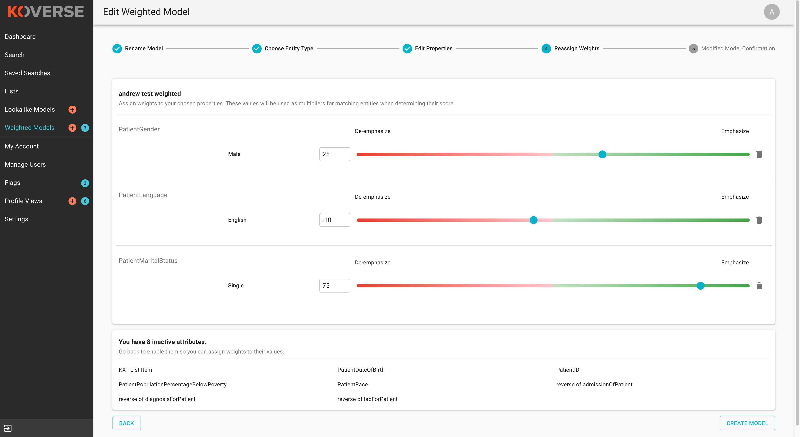
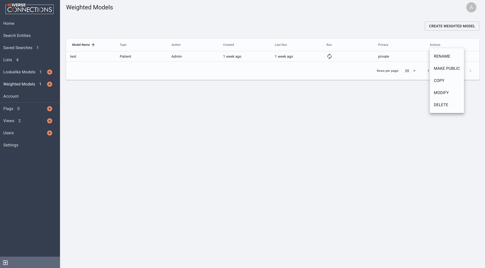

Weighted Models
---------------
A Weighted Model creates a list based on user selected attribute weighting. For example: Potential customers are scored based on an algorithm that is as follows:
0.2*assets+0.3*last quarter performance+0.25*consultant rating+0.25*percent assets in S&P 500.

Create a Weighted Model
+++++++++++++++++++++++

To create a weighted model navigate to the Weighted Models tab and click "CREATE WEIGHTED MODEL". You will be asked to:

1. Name Your Weighted Model
  - Koverse Connections stores all weighted models in specific Weighted Models list, so there is no need to name it 'Weighted model of ...' Instead, try to give it a self explanatory and meaningful to you name.
2. Choose the entity type your weighted model will run on
3. Choose the fields and values you would like to focus on for your new weighted model
  - If a field has more than one value, you may select one or multiple values. On the next page you will be able to individually weight each value. (NEEDS IMAGE)
4. Assign weights to your chosen properties. These values will be used as multipliers for matching entities when determining their score.
  - Here you can assign weights to each chosen value from the Edit Properties step.
  - You can type in a weight or use the slider to choose a weight.
  - You can also delete a value that you no longer wish to give a weight in your model.

Run a Weighted Model
++++++++++++++++++++

To run a weighted model, from the Weighted Models tab, click on the weighted model you want to run.

On the next page, click on "RUN MODEL". You should see a green prompt in the lower left hand corner of your browser window telling you "Model has been queued". This model will then run based on your Koverse Connectons system settings.

Weighted Model Options
++++++++++++++++++++++
From the Weighted Models tab you can click on a weighted model to access more details.

From the actions menu drop-down you can: rename a weighted model, make public or private a weighted model, copy a weighted model, modify a weighted model, or delete a weighted model.

On the details page of a weighted model you can:

- View more information about the weighted model including: Name, number of entities, who created the model, and when the model was last run
- Make the weighted model private or public using the "Public/Private" toggle
- Run the weighted model
- Rename the weighted model
- See the entity results of the weighted model
